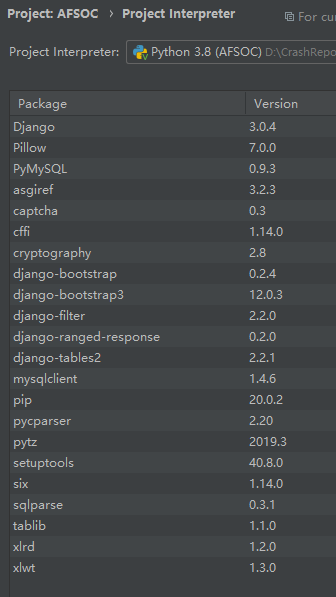

## 1. 开发环境与工具版本

> - Windows10
> - Python3.8
> - Qt5.9.7
> - Visual Studio 2017
> - PyCharm2019.3.2
> - MySQL8.0

## 2. 文件结构说明

```
├─AFSOC                             项目代码
│  │  manage.py                     
│  │          
│  ├─AFSOC
│  │  │  settings.py                项目配置文件
│  │  │  urls.py                    项目路由文件
│  │  │        
│  └─AFSOC_app                      项目中的应用，主要代码
│     │  admin.py
│     │  apps.py
│     │  filters.py                 过滤器类
│     │  forms.py                   表单定义
│     │  models.py                  模型，即本设计中的实体类定义
│     │  tables.py                  表格类定义
│     │  urls.py                    应用中的路由文件
│     │  views.py                   视图文件，主要的逻辑代码，页面模板与模型的交互
│     │  
│     ├─migrations                  将模型移植到MySQL生成的文件
│     │          
│     └─templates
│        └─AFSOC_app                应用中的模板文件
│                  
├─codes
│  │  GenerateDumpFile.cpp          模拟中用来生成一个实验用的dmp文件代码
│  │  zipFiles.py                   将生成的实验用txt文件和dmp文件打包压缩的代码
│  │  
│  └─GenerateTxtFiles               生成模拟用的txt文件代码
│  ngrok-stable-windows-amd64.zip   转发本机网址的程序压缩包
│  standard.dmp                     生成的模拟用dmp文件
│  实验记录与对比.xlsx               模拟实验的结果记录与对比表格
├─images                            本设计中的图所在文件夹
├─handled                           实验用已处理的压缩包文件夹
└─receiveFiles                      实验用未进行处理的压缩包文件夹
```

## 3. 使用说明

### 3.1 前期准备

1. 使用codes文件夹下的GenerateDumpFile.cpp文件生成一个模拟用的dmp文件，GenerateTxtFiles项目会生成模拟用的txt文件，设定生成数量为一千个，要求使用Qt，同时由于随机数的关系，设定了每秒只生成一个文件，因此全部生成完毕需要十来分钟。zipFiles.py文件会将这些生成的txt文件和dmp文件打包成同名的压缩包，放入receiveFiles文件夹。
2. 使用PyCharm打开AFSOC项目，需要MySQL，各种第三方库如下图所示：

   

3. 查看项目中的settings.py文件中需要确认自己数据库的账号密码，并保证有该数据库。
4. 在PyCharm的命令行中，输入下述命令将项目的模型移植到数据库中：
    ```
    python manage.py makemigrations
    python manage.py migrate
    ```
5. 现在需要为项目创建一个管理员，在admin后台下新建一个部门和正常的管理员账号，之后就可以使用这个管理员账号进入系统进行正常的创建用户和其他操作，当然也可以在admin后台下多创建一些用户。使用如下命令创建超级用户:
    ```
    python manage.py createsuperuser
    ```

### 3.2 使用系统

1. 做好一切准备之后，就可以使用这个系统了，可以直接在PyCharm界面上点击运行或者Debug按钮，也可以在命令行输入```python manage.py runserver```运行服务，然后就可以在127.0.0.1:8000进入系统了。
2. 进入系统之后可以使用先前在admin后台中创建管理员账号登录，就可以看到四大模块，分别是报告处理、用户管理、任务中心和个人中心。
3. 报告管理模块中，管理员角色可以点击自动分配按钮，将receiveFiles文件夹下的压缩包信息读取至数据库，给当前系统中的开发者分配任务，并将结果显示在界面上，已经被分配的压缩包，会被移动到handled文件夹。
4. 用户管理模块中，管理员可以对用户进行增删改查的操作。
5. 任务中心模块中，管理员可对所有任务进行增删改查的操作，经理只能对所在部门的任务进行增删改查操作，开发者只允许对分配给自己的任务进行任务的状态修改操作。
6. 个人中心模块，所有的用户都可以修改自己的密码。
